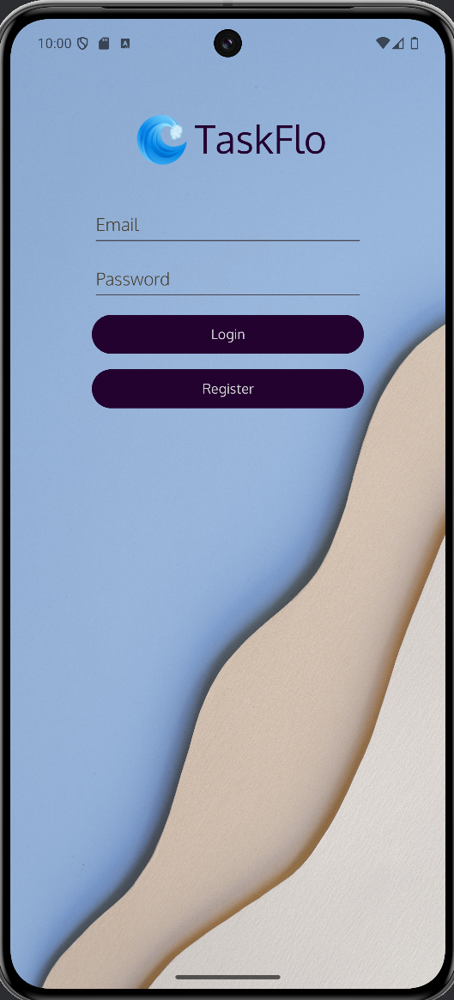

# Release Notes - v0.4.0

## What’s New:
- CRUD Operations are now fully functional, making task management more efficient.

- Firebase Integration: Complete integration with Firebase for secure handling of user data and tasks. Firebase Authentication is used for login, registration and logout, with tasks securely stored in Firestore.

- Enhanced UI/UX: The user interface has been refined for a smoother experience.

- Task Management: Tasks can now be viewed, added, edited, and deleted directly within the app. Task cards are displayed in a clean, organized format for easy management.

## Upcoming Features:
- Password Confirmation: Adding a password confirmation step during registration.
  
- Testing: Ongoing work on unit and automated testing to ensure reliability and performance.

- Multithreading to improve app performance.

- Date and time as option when creating tasks, allowing users to choose to have push notifications sent from the app as a reminder.

- Dark mode.

- Projects cards - collections of tasks, allowing users to organize tasks more neatly.

## Documentation
For further guidance and detailed documentation, please refer to the following resources: 

- Android Developers Documentation: Android Docs --> https://developer.android.com/guide/
- Firebase Documentation: Firebase Docs --> https://firebase.google.com/docs/
 
 
I appreciate your interest and involvement in this project as it continues to develop. Feedback is welcome as I work towards improving the app.

