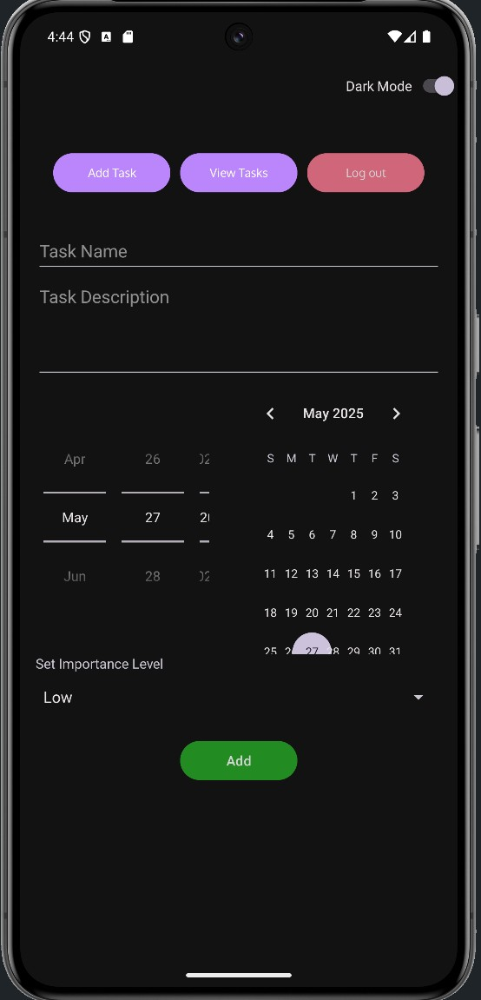
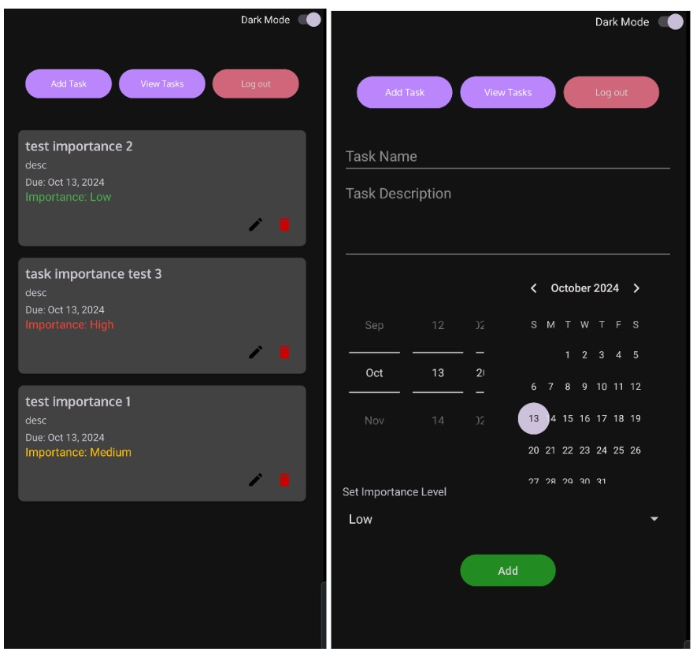
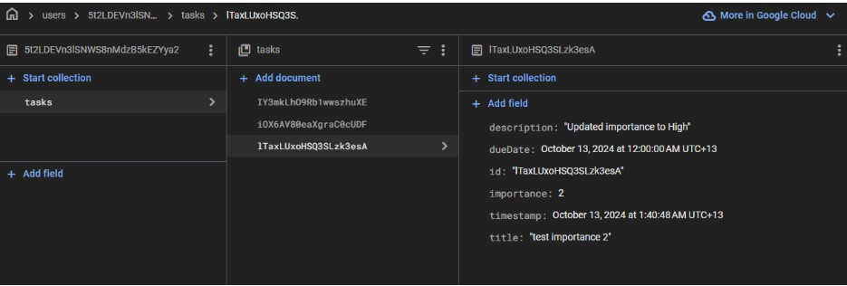

## v0.5.0
- A dark mode to improve user experience.
  
- Further implementation of the CRUD Operations - Added task due date and importance level, both are full CRUD similar to Title and description.
  
- Adjusted UI, theme and colours, font size for a better aesthetic.

## v0.4.1
- Added a separate view for registration, require user to confirm password upon creating an account.

## v0.4.0

- CRUD Operations are now fully functional.

- Firebase Integration:  Authentication and database.

- Enhanced UI/UX.

- Task Management: Tasks can now be viewed, added, edited, and deleted directly within the app..
 

## Documentation
For further guidance and detailed documentation, please refer to the following resources: 

- Android Developers Documentation: Android Docs --> https://developer.android.com/guide/
- Firebase Documentation: Firebase Docs --> https://firebase.google.com/docs/

